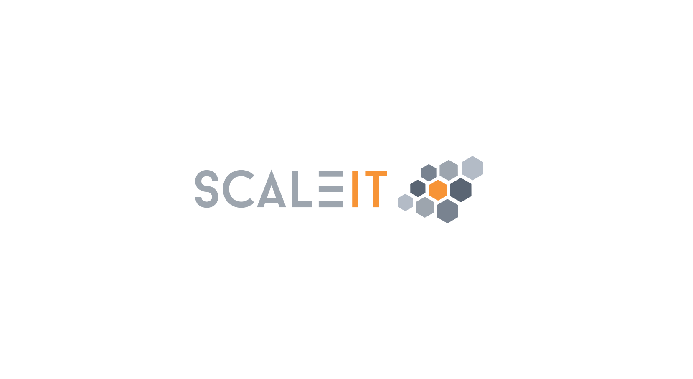

.. _skeleton:
Template Skeleton
-----------------

.. Will render an image with content svg, text not selectable

..    :scale: 50 %
..    :alt: ScaleIT value proposition in one glance

..    ScaleIT value proposition in one glance.

.. text selectable
.. raw:: html

    <object data="_images/scaleit_logo.svg" type="image/svg+xml" width="100%"></object>

Die Säulen des Wissens
^^^^^^^^^^^^^^^^^^^^^^^^^^

.. figure:: img/scaleit_logo.png
   :scale: 50 %
   :alt: Alt Text Placeholder

   Caption Placeholder

.. note::
  :ref:`ScaleIT success stories hier! <success stories>`
    Sehen sie wie ScaleIT unseren Partneunternehmen geholfen hat. 

X
#################################

AAAAA
^^^^^^^^^^^^^^^^^^^

BBBB
^^^^^^^^

.. "Don't trim your toe-nails with a lawn mower".
XX
###################################################

.. figure:: img/scaleit_devops.png
   :scale: 50 %
   :alt: ScaleIT DevOps Prozess Überblick

   In ScaleIT ist der Lebenszyklus eines Stückes Software (der App) vereinfacht.

Durch das Vereinen von Development und Operations (Entwicklung und Inbetriebnahme) wird es Experten ermöglicht Software leicht auf den Hallenboden einzusetzen oder zurückzurollen. Da Apps Seiten-Effekt frei sind, können nach dem Baukastenprinzip Apps entfernt werden.

 Footnote [#f1]_

 Footnote 2 [#f2]_

.. rubric:: Footnotes

.. [#f1] https://commons.wikimedia.org/wiki/File:A-B_testing_example.png
.. [#f2] https://commons.wikimedia.org/wiki/File:Ab-test.jpg
