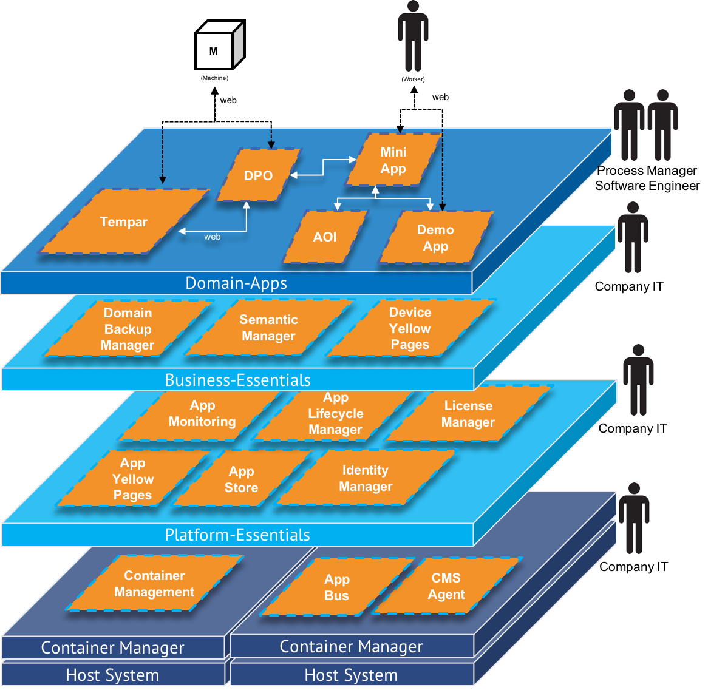
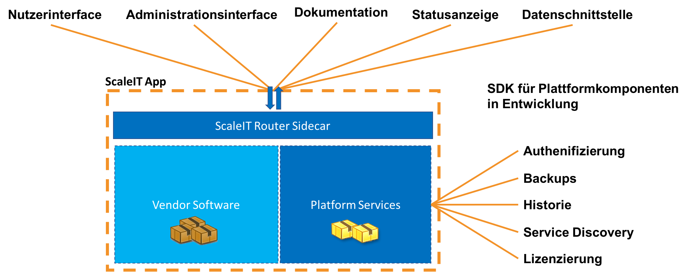
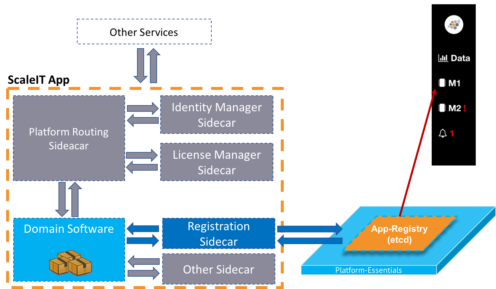
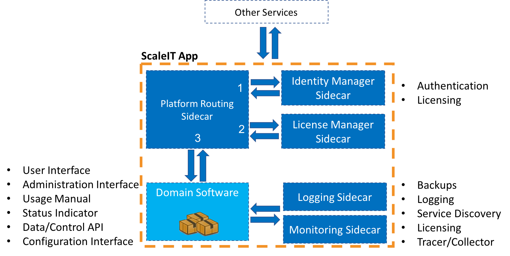

.. _ScaleIT Architektur:

ScaleIT Architektur
===================

Don't forget to look at the :ref:`App Design Richtlinien <app design>` to build a better understanding of what a good App is.

:ref:`App Readiness Checklisten hier <app readiness>`

------------

Ebenen der Architektur
----------------------

The ScaleIT architecture allows teams or organisations to manage their own IoT landscape and innovate in their own pace using a parallel IT landscape. This landscape is usually called a shadow IT. This niche for the shadow IT arises from the dichotomous relation between shop floor software engineers and the company wide IT. While shop floor software engineers are enabled to have full control of their deployment environment, the company IT hosts these virtual environments isolated inside the company network. A shadow IT allows the shop floor teams to move independently to the central IT operations.

In this layered architecture, layers below provide software side control for the layers above (bottom up). The top down interaction is facilitated mainly by using pre-built platform services as sidecars. These sidecars are deployed bundled with the Apps (Fig. 3).
The figure below illustrates the abstracted planes of responsibility, each housing a different set of Apps:

   ScaleIT Architektur mit den unterschiedlichen Ebenen und verantwortlichen Rollen.

Domain-Apps
   Apps that implement business cases reside on the domain App plane. It is the abstraction level at which business case applications are deployed (visualisation Apps or HMIs, machine learning Apps etc.). This is the plane where the process managers (Prozessleiter) would pick click-to-install Apps from an App store in support of the business processes. Workers come in contact with theses apps in their day to day work. Shop floor IT engineers deploy in-house App on this plane. Shop floor software innovation can thus be realized by adding a new or updated set of Apps.
Business-Essentials
   The business essentials plane houses Apps that are rele- vant to the stability of the domain apps and therefore the business. This is also the plane where the IT team of the company would maintain their backup solutions, audit logs
Platform-Essentials
   The platform essentials plane houses Apps that are re- quired to run the shop floor eco-system at an App level (App registry, App monitoring, routing, logging, App traces). This is the plane where a business would not need to do software lifecycle specific tasks as it will be comprised as open source, open platform distribution. Adapting the Apps on this plane is done through configuration via Web interfaces.
Container Manager
   The container manager is responsible for the App lifecycle (start, stop, restart, update, replication) and provides an overview of the shop floor eco-system at a container level.
Host System
   The host system is mainly a operating system running on hardware that is sufficient for the Apps deployed on it. The host system only requires a runtime engine for a con- tainer system (e.g. Docker). All subsequent software is in- stalled henceforth (bottom to top) as containers. Because all software runs inside containers, the host system can be ei- ther physically co-located with the shop floor or somewhere within the company or public cloud. Furthermore, addi- tional host systems may be Raspberry Pi-like devices where only an agent of the container manager is run.

By employing Web-based microservices, continuous deliv- ery, containerization, infrastructure as code and a DevOps culture, we believe that manufacturers can start building IoT solutions and scale them easily with their evolving busi- nesses, especially leveraging the ubiquity of modern Web technologies.

Given an open source reference implementation of the Platform-Essentials plane and corresponding side cars, a manufacturing company can spin up an entire software eco- system and deploy basic applications on it, even when staff capacity is limited. The use case implementation section details a scenario where a manufacturer managed to bring their new application into production in a faster and safer manner.

Shopfloor Roles Supported by ScaleIT
------------------------------------

Viewing from the manufacturing perspective, there are several key roles held by the actors within an Industrial IoT system. Each of these actors is working with different levels of domain abstraction:

Workers 
   Despite a high automation degree, workers are central to the execution of shop floor processes. They need to receive information about the relevant states of the system and use apps as aid in their tasks.
Process manager 
   The design and controlling of shop floor processes lies in the responsibility of the process manager. This actor will usually search for productivity improvements while ensuring that the quality standards are met. By working data driven, the process manager is on the lookout for new applications that can bring benefits to the manufacturing process (dashboards, worker information applications).
Shop floor IT Engineers 
   Employees with software engineering experience, usually in small teams, are tasked with keeping the automation technology or the machine software running. They use their limited capacity to bring innovation through domain specific software onto the shop floor (usually triggered by the process manager).
Company IT
    The Company IT is responsible for the security and reliability of the company networks and company wide software distributions (Office suite, CAX engineering software). In contrast to the other actors, the company IT very seldomly comes into contact with shop floor applications.
Independent vendors
    Vendors are 3rd party software distributors and software component providers across all actors. Companies usually incorporate 3rd party software for the entire automation pyramid. However, most of the time, system integration is done manually in an ad-hoc manner by employees.

The above roles are a generalisation and the responsibilities may be be split between several persons. However, these roles are central to the continuous functioning and evolution of the shop floor.

App Anatomy
-----------

   Eine ScaleIT-App besteht aus der Nutz-Software, die einer direkten Werstschöpfung dient, sowie der Plattformkomponenten die über das Sidecar-Pattern eingebunden werden.

Sidecar Pattern
^^^^^^^^^^^^^^^

   Durch das Sidecar-Pattern werden Plattformfunktionalitäten hinzugefügt.

   Caption Text

   Caption Text

