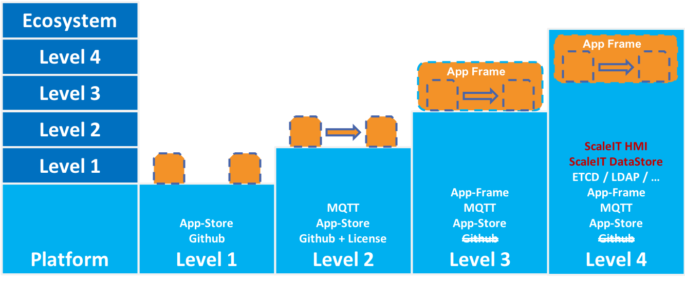

General Capabilities
--------------------

Compliance Level 0
++++++++++++++++++

An app must ...

* Meet the X-Readiness Checklist
* Be uniquely identifiable and by a URL or IP(v4/v6) Adress
* Have a human readable Web UI at its adress
* Support at least HTTP/1.1
* Works standalone with a minimal feature set.
* Communicates Errors to the user

Compliance Level Max
++++++++++++++++++++

* Must follow the Engineering Readiness list

Networking
----------

An app must ...

Level 0
++++++++++++++++++
* Have an open TCP/IP network pathway to the Web-UI (IP+Port/URL).

Level 1
++++++++++++++++++
* Reverse Proxy Support with static (per deploy) qualified domain names
* Able to receive HTTPS requests

Level 2
++++++++++++++++++
* Able to send and receive MQTT messages

Level 3
++++++++++++++++++
* 

Data Handling Capabilities
--------------------------

Level 0 
+++++++
* Supports JSON Syntax for data exchanges.
* Parse errors or data handling exception do not cause the app to crash

Level 1 
+++++++
* Supports JSON Syntax for data exchanges and returns parsing error information

Level 2 
+++++++

Level 3 
+++++++

Level 4 (Semantic Enabled)
++++++++++++++++++++++++++
* Expose RDF-structured data with semantic annotations.
* JSON-LD as recommended syntax format for data exchange
* Vanilla JSON for backwards compatibility
* Self-describing API (eg. using the Hydra vocabulary).

have a root resource accessible via an HTTP URL. *
expose a REST API. *
accord to the highest level of maturity in the RMM. *
fulfill all four Linked Data principles. *
implement passive communication.
use JSON or 

over a human-facing HTML representation or user-interface.
be stateless. *
explicitly declare its dependencies, instead of relying on system-wide packages

Future Readiness, ensure the app...
* Has HTTP2 support and can be upgraded to HTTP2
* ...

   App Compliance Level structure

