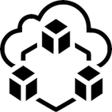
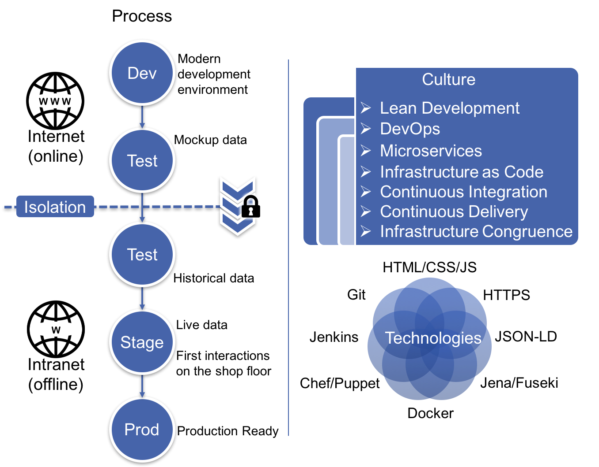

Get Started
===========

Technical Getting Started
-----------------------------

|github| `Click here for the technical getting started (GitHub) <https://github.com/ScaleIT-Org/documentation>`_

|architecture| :ref:`Click here for the architecture documentation and white paper <ScaleIT Architektur>`

.. |github| image:: img/icon_github.png
            :scale: 20%

Understanding the Shop Floor
----------------------------

IoT Aspects of the Shop Floor

Wo befinden wir uns wenn wir vom betrieblichen Hallenboden reden?

Production ready IoT systems require a sophisticated and robust infrastructure. There are a multitude of services and open source technologies that allow the realisation of such systems with minimal effort. In practice however, and especially in the manufacturing domain, it proves difficult to bring these technologies into production and as a result the shop floor cannot benefit from the advantages of the IoT.
Working in close cooperation with small and medium sized manufacturers, we have identified several key issues they face when dropping the monolithic approach and adopting IoT technologies and an IoT mindset:

.. figure:: img/hallenboden.png
   :alt: Der Hallenboden

   The manufacturing shop floor where people, machine and sensors interact not just physically but also virtually through software.

* The shop floor systems are isolated from the Internet.
* System landscapes are dominated by unconnected silos or monoliths (Enterprise Service Bus, ERP Systems, large central data warehouses). These are difficult to evolve and do not fit with the distributed nature of the shop floor.
* Technology choices are limited to only a handful of in-house-approved stacks due to restricting corporate IT policies (e.g. Windows only world).
* It is hard to iterate through software versions due to difficult development and deployment and divergent infrastructure.
* Slow, low risk approach to potential game changer technologies due to a (justified) high risk aversion regarding the control software for the production lines.
* Difficult testing and simulation using realistic or real data as it is either non existent or not easily reusable.
* It is generally hard to create a distributed interconnected environment having only a limited workforce consisting of small IT teams and no dedicated ecosystem software engineers.

By incorporating key software engineering concepts (versioning, containerisation, continuous integration, continuous deployment, App runtime environment) the proposed architecture aims at giving manufacturers a ready to use infrastructure with the ingredients for a healthy and flexible software eco-system on the shop floor.
We believe that the design principles listed below are central to a shop floor architecture that supports IIoT applications:

* Support silo centerd architecture
* Resilience first design
* Rapid deployment

ScaleIT System Landscape
------------------------

Using ScaleIT, you imbue the IT landscape on your manufacturing shop floor with the best practices from modern software development and can harness benefits such as faster innovation cycles, lower risk and increased productivity by using better tools.

    The Web of manufacturing overview

**References**

`Some icons provided by oNline Web Fonts <http://www.onlinewebfonts.com>`_