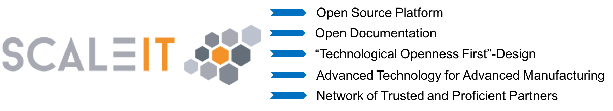

.. ScaleIT Platform Documentation documentation master file, created by
   sphinx-quickstart on Fri Dec 22 17:52:47 2017.
   You can adapt this file completely to your liking, but it should at least
   contain the root `toctree` directive.

Welcome to the ScaleIT Platform documentation!
==========================================================

.. toctree::
   :maxdepth: 2
   :caption: Contents:

   getstarted
   proposition
   appdesign
   security

Indices and tables
==================

* :ref:`genindex`
* :ref:`modindex`
* :ref:`search`

What is ScaleIT?
================

ScaleIT is a solution to bring advanced IT technologies to manufacturing companies. 

There are three main components to the ScaleIT solution.

.. todo::
   Image with ScaleIT Eco System, ScaleIT Software Platform, ScaleIT Hardware

ScaleIT Software Platform - In IT, a platform is any hardware or software used to host an application or service. An application platform, for example, consists of hardware, an operating system and coordinating programs that use the instruction set for a particular processor or microprocessor. - searchservervirtualization.techtarget.com/definition/platform

Open Source:
When a project is open source, that means anybody can view, use, modify, and distribute your project for any purpose. These permissions are enforced through an open source license.

Value Proposition
-----------------

   ScaleIT value proposition in one glance.

