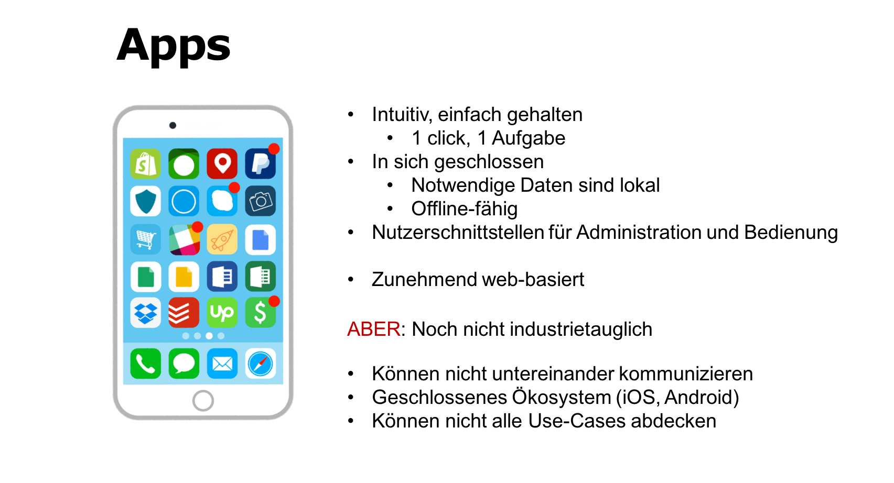
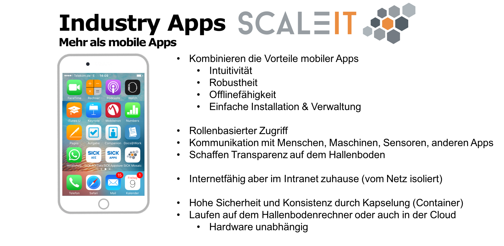
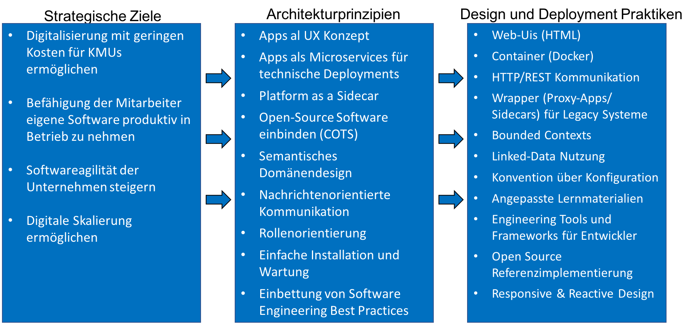
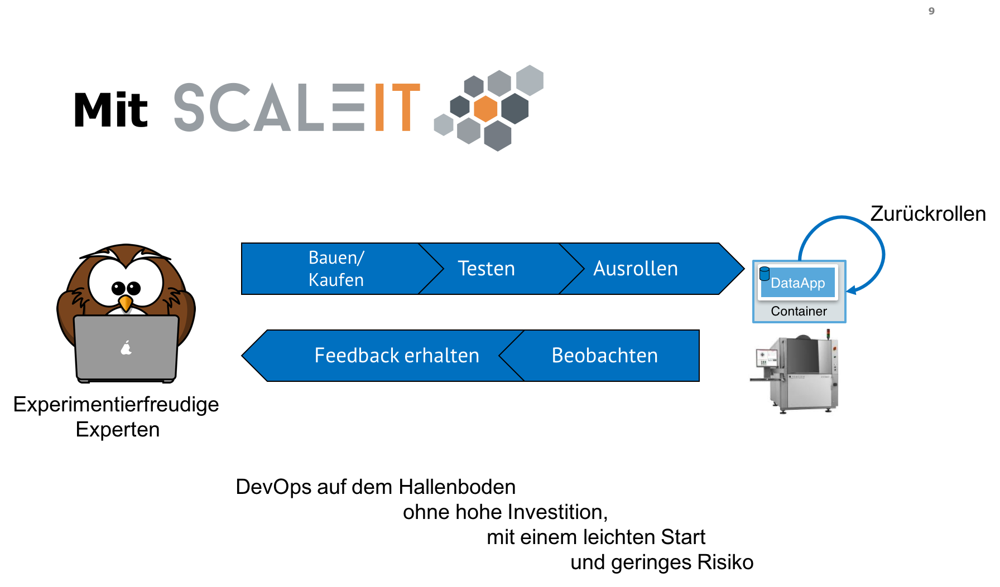
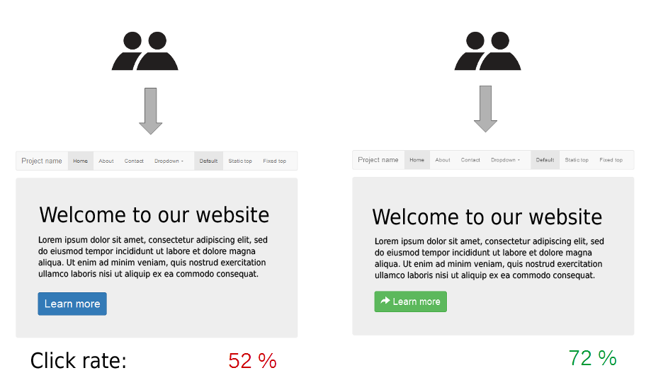

.. _value proposition:
Value Proposition
-----------------

.. Uncommnet when generating PDF as raw will not be rendered
.. .. figure:: img/value_proposition.svg
..    :scale: 50 %
..    :alt: ScaleIT value proposition in one glance

..    ScaleIT value proposition in one glance.

.. raw:: html

    <object data="_static/value_proposition.svg" type="image/svg+xml" width="100%"></object>

Digitalisierung durch Apps
^^^^^^^^^^^^^^^^^^^^^^^^^^

   Apps bieten Nutzern einen hohen Wert durch die Einfachheit der Installation und Bedienung, sowie der optimierten nutzefreundlichkeit (UX).

   Zusätzlich zu der Bedienungsfreundlichkeit von Smartphone-Apps, bieten die Industriellen Apps von ScaleIT weitere Vorteile und können im betrieblichen Kontext eingesetzt werden.

.. note::
  :ref:`ScaleIT success stories hier! <success stories>`
    Sehen sie wie ScaleIT unseren Partneunternehmen geholfen hat. 

ScaleIT Digitalisierungsstrategie
#################################

.. .. raw:: html

..    <object data="_static/digitalisierung_durch_scaleit.svg" type="image/svg+xml" width="100%"></object>
..    Digitalisierungschritte durch ScaleIT: von der Strategie hin zu den konkreten Maßnahmen.

   Digitalisierungschritte durch ScaleIT: von der Strategie hin zu den konkreten Maßnahmen.

Anforderungsanalyse
^^^^^^^^^^^^^^^^^^^

If you wish to analyse your requirements regarding Apps, visit our ScaleIT App Workshop Kit: 
https://github.com/ScaleIT-Org/workshop-app-prototyping

Prozesse
^^^^^^^^

Die Verbesserung von Prozessen auf dem betrieblichen Hallenboden ist eines der Hauptziele von ScaleIT. Unser Ansatz heißt `Die richtige Software für den richtigen Job einsetzen`.

.. "Don't trim your toe-nails with a lawn mower".

Software auf dem Hallenboden risikolos ausprobieren
###################################################

   In ScaleIT ist der Lebenszyklus eines Stückes Software (der App) vereinfacht.

Durch das Vereinen von Development und Operations (Entwicklung und Inbetriebnahme) wird es Experten ermöglicht Software leicht auf den Hallenboden einzusetzen oder zurückzurollen. Da Apps Seiten-Effekt frei sind, können nach dem Baukastenprinzip Apps entfernt werden.

A/B Testing
###########

Durch die Vereinfachung der Installation von Software durch ScaleIT, wird es mittelständischen Betrieben ermöglicht unterschiedliche Apps auszuprobieren und dann die geeignetste App zu behalten. 

Sucht ein Unternehmen beispielhaft ein Projektmanagementwerkzeug, dann kann es die Redmine-App, die Gitlab-App oder eine andere App aus dem Katalog installieren und diese parallele betreiben und ausprobieren. 

Die Entscheidung wird so durch reelen Einsatz der Software im betrieblichen Alltag unterstützt.

  A-B Test Beispiel [#f1]_

.. figure:: img/A-B_testing_example2.*
  :align: center
  :alt: ScaleIT value proposition in one glance

  A-B Test Beispiel [#f2]_

.. rubric:: Footnotes

.. [#f1] https://commons.wikimedia.org/wiki/File:A-B_testing_example.png
.. [#f2] https://commons.wikimedia.org/wiki/File:Ab-test.jpg
