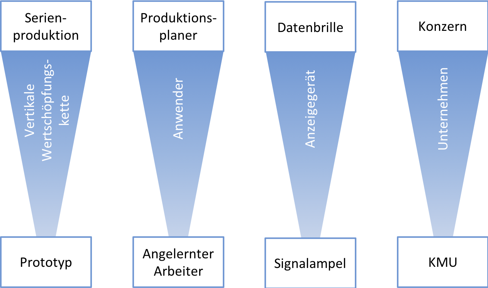
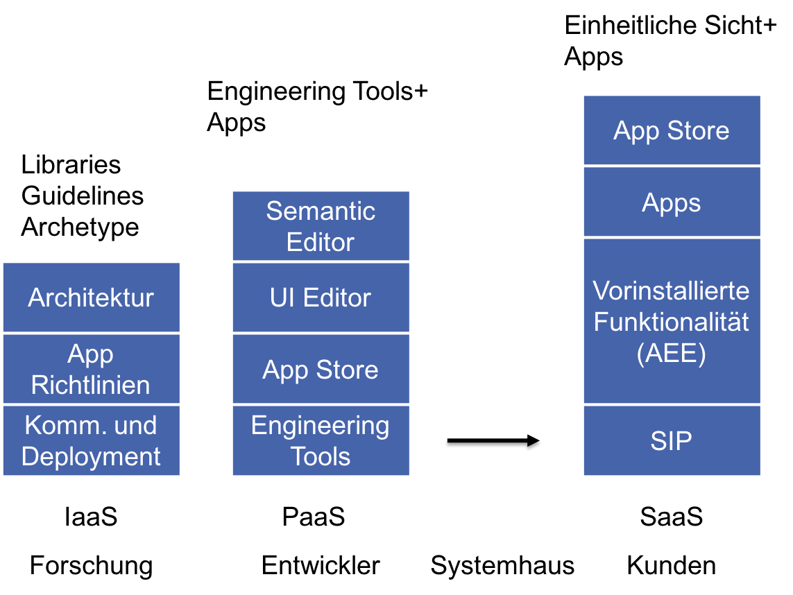
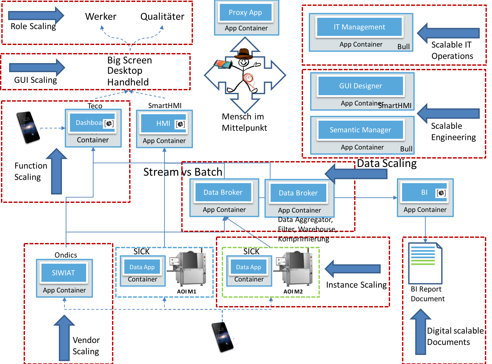
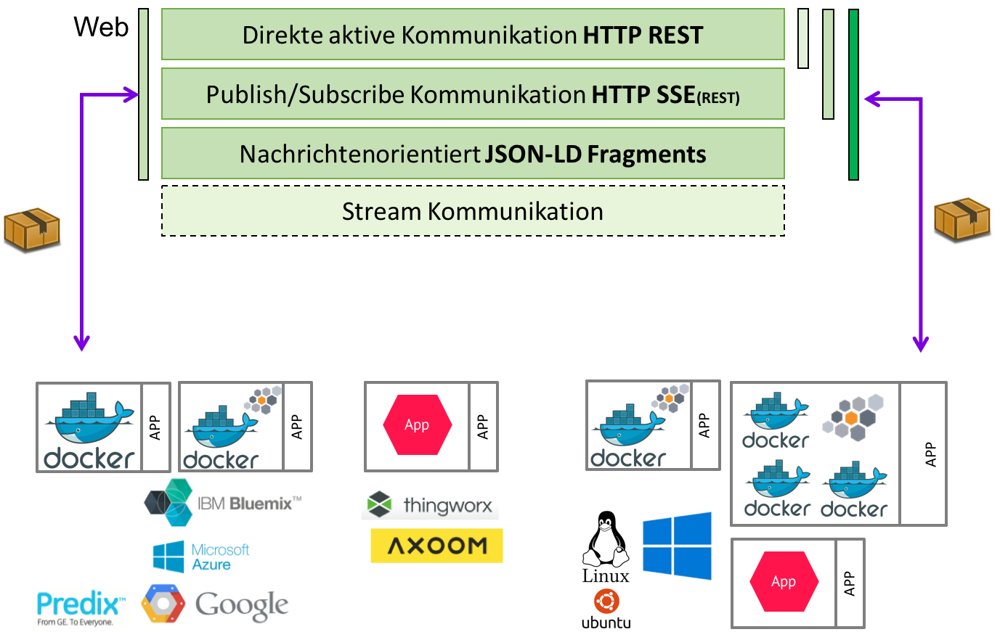

.. _ScaleIT Skalierung:

Skalierung innerhalb ScaleIT
============================

Liste der Skalierungs-KPIs für die ScaleIT Plattform und das ScaleIT-Ökosystem.

Skalierung auf der Firmen-Ebene
---------------------------------

   Die Hauptaspekte der skalierbaren IKT zur Nutzung auf dem Hallenboden.

Plattform Skalierung
--------------------

Die hier vorgestellten theoretischen Skalierungsebenen der Plattform dienen als Grundlage für die organisation und das Ausrollen der ScaleIT-Plattform-Lösung bei Firmen von unterschiedlichen Größen und IT-Kompetenzen.

Die Skalierungsdimensionen sind (a) das Level an Plattformfunktionalität (Iaas-SaaS), (b) die verantwortlichen Entitäten für das Vorantreiben der Entwicklung (Forschung, Entwicklung, Systemhäuser, Kunden), (c) die Komplexität der Lösung mit Hinblick auf die vollständige Integration in die Unternehmenslandschaft (Libraries, Engineering Tools, einheitliche Sicht).

   Die Skalierung der Plattform bezüglich auf die Plattformfunktionalität, der Weiterentwicklung und der Integration in die Unternehmenslandschaft.

Architekturell-technische Skalierung
------------------------------------

Die technische Skalierung weist eine hohe intrinsische Komplexität auf. Das Ziel der ScaleIT-Architektur ist es die extrinsischen Faktoren zu minimieren. Der Mensch muss weiterhin als kreatives Element einbezogen werden, um logisch sinvolle Anwendungsnetzwerke und vernetzte Dienste zu ermöglichen. Die von ScaleIT bereitgestellten Technologien, Konzepte und Paradigmen bieten hohe gestalterische Möglichkeiten ohne Nutzer und Entwickler unnötig zu belasten.

   Überblick der technischen Kernskalierung dank der ScaleIT Architektur

Software Technisch Architekturell
    Microservices
        Die Software-Organisation von ScaleIT beruht auf den Prinzipien der Microservice Architektur (die moderne Reinkarnation der SOA - Service Oriented Architecture). Dadurch bietet sich die flexible Organisation und Reorganisation der Software auf den betrieblichen Hallenboden.
    Lambda
        Innerhalb der ScaleIT-Architektur kann eine Lambda-Architektur abgeblidet werden. Die Apps müssen ledliglich in die jeweiligen Batch und Speed Layer eingeordnet werden. Hier bietet sich die Option an, die Layer der Lambda-Architektur auf unterschiedliche Hosts aufzuspalten. Alternativ kann ein System wie z.B. Spark direkt als App laufen (dabei ist jedoch zu beachten, dass solch komplexe Apps am besten auf einem separaten Host mit ausreichend Ressourcen und Monitoring ausgefürt werden).
    Kappa
        Die Kappa-Architektur ist die von ScaleIT empfohlene Software-Organisation für Szenarien die auf Datenerhebung und -analyse zielen. Besonders bei Implementierungen mit digitallen Zwillingen kann durch die lokale Speicherung der Daten von der jeweiligen Maschinen-App eine einfache und robuste Implementierung realisiert werden.
    FaaS - Function as a Service
        Wenn es um das Ausrollen von kleinen in sich geschlossenen Funktionalitäten geht, so bietet sich innerhalb der ScaleIT-Architektur die Option eine FaaS-App einzuseten. Dies ist besonders sinnvol, um eine automatische Skalierung bei wiederholten Aufrufen einer einfachen ausführbaren Logik (wie z.B. das Auswerten eines ML-Modells auf Anfrage über eine HTTP/REST Schnittstelle). Das Erstellen multipler Apps für solch kleine Funktionen ist nicht zielführend und wirkt sich negativ auf die Wartung der Instanz.

Programmiersprachen
    Polyglote Stacks sind in ScaleIT möglich und dienen auch der Funktionsskalierung und der horizontalen sowie auch der vertikalen Vernetzung. Ein zu breites Spektrum an Technologie-Stacks sollte aber vermieden werden, um den Wartungsaufwand klein zu halten (siehe auch Microservice Best Practices).

Kommunikation 
    Datentransfer über Web-Technologien
        Kommunikationsmechanismen die in ScaleIT App eingesetzt werden können sind folgende:

            REST/HTTP (Empfohlen)
                * Request Reply und Polling über HTTP Methods (GET, POST, PUT, DELETE)
                * Streams über Server Sent Events (SSE)

            GraphQL (Experimentell)
                * Graphbasierte abfragen über das Web mit Pagination Support

            MQTT
                * QoS gesicherte Streams

            WebSockets
                * Payload-agnostisches Protokoll ohne Transfersemantik 

            RTC
                * Real Time Web Kommunikation (z.B. Kamera-Streams)

            gRPC/Protocol Buffers
                * Hocheffiziente Remote Procedure Calls über das Web (z.B. auch über Captain Proto)

    Stream vs Poll vs Batch
        Durch die unterschiedlich unterstützten Kommunikationsmechanismen ist es möglich eine für den Anwendungsfall optimale Lösung zu finden. Für Datengetriebene Anwendungen werden bei ScaleIT Streams über SSE und für Polling(Request/Reply) HTTP empfohlen. Zu beachten ist, dass HTTP schon eine Semantik mitbringt, MQTT und WebSockets nicht. MQTT eignet sich aber sehr gut, um den Nachrichtenaustausch bezüglich der Zustellung zu sichern und bietet dazu 3 Level an Quality of Service (QoS).

Payload Skalierung
    In ScaleIT ist das empfohlene Datenformat der Payload eine semantische Darstellung in JSON-LD. Es können jedoch auch andere Formate genutzt werden (wie z.B. JSON, Protocol Buffers, proprietäre Formate etc.). Dies ermöglicht eine Skalierung bezüglich der datengetriebenen Interaktion zwischen Apps, vorausgesetzt die Apps unterstützen diese Datenformate. Nutzt man eine semantische Darstellung, dann wird.
    Durch JSON-LD(und auch JSON) können auch inkomplette Nachrichten verschickt werden, ohne das Anwendungen abstürzen und diese auch nur Teilverarbeitung ermöglichen.

Migration auf andere technische Plattformen
    Durch die Containerisierung der ScaleIT Apps und des dazügehörigen Infrastructure as Code (IaC) Paradigmas ist die Migration von ScaleIT Software auf andere Plattformen sehr effizient. Der Kern der App Architektur bildet das Prinzip des Platform as a Sidecar, so dass Apps mit einer minimalen Konfigurationsänderung auf einer anderen Instanz laufen können oder ein Wechsel weg von ScaleIT (z.B. auf öffentliche oder private Clouds) möglich ist. Durch die Lokalität der Daten innerhalb der Apps, sind bei korrekten Implementierungen der Plattform keine Datenmigrationen notwendig. Auch aus diesem Grund ist keine zentrale Datenhaltung empfohlen (außer Backup und Archivierung).

Funktionalität von Dritten
    Da KMUs meistens keine eigene Software-Entwicklung betreiben erlaubt es die modulare ScaleIT-Architektur Software (Apps) von Drittanbietern und Dienstleistern einzubinden. Durch das technologieagnostische Design können auch unterschiedliche Dienstleister Software für dieselbe Firma aktiv werden.

Dokumentation

Daten

Funktionsskalierung
    Die in der ScaleIT-Architektur unterstützen Paradigmen Container, Microservices und FaaS erlauben ein Reibungsloses Klonen von schon vorhandenen oder die Integration von neuen Funktionalitäten.

Egineering(Tools)

Management
    Ein zentralisiertes Management ist möglich in der ScaleIT-Architektur und in größeren Instanzen empfohlen. Durch das installieren der passenden Apps (Kubernetes) kann z.B. das Container-Managment automatisiert werden.

Monitoring & Logging
    Ein zentralisiertes Management ist möglich in der ScaleIT-Architektur und in größeren Instanzen empfohlen. Durch das installieren der passenden Apps (ELK Stack) kann z.B. das Logging zentralisiert und durch Dashboards auch für den Nutzer zusammengeführt werden.

Nutzeröberflächen
    Die in ScaleIT genutzten Web-Technologien erlauben Responsive Design und Adaptive Design anzuwenden, um die Oberflächen der Apps auf unterschiedliche Geräte zu skalieren. Z.B. kommt das in der Open Source Referenzimplementierung empfohlene Ionic-Framework mit Responsive Design out-of-the-box.

Rollen
    Die Mitarbeiterrollen in einem Unternehmen sind ein wichtiger Aspekt der organisationellen Kultur. Die ScaleIT-Architektur erlaubt es Apps (u.a. auch Open Source Apps) zu nutzen, um unterschiedlichen Unternehmensgrößen und Bedarfe zu decken. Gekoppelt mit dem Singel-Sign-On Mechanismus (SSO Manager + SSO Sidecars) werden die Rolleninformationen allen Apps die damit umgehen können bereitgestellt. Auch kann dieser Mechanismus nachgerüstet werden und muss nicht in der Intialinstanz vorhanden sein.

Development & Operations & Agilität
    Die ScaleIT-Architektur ist für alle modernen Arbeits- und Entwicklungsprozesse ausgelegt. Durch das installieren der passenden Apps können z.B. auch DevOps oder DevSecOps Anwendung auf den betrieblichen Hallenboden finden.

   Die Skalierung der Kommunikation bezüglich auf die Art des Transfers.

