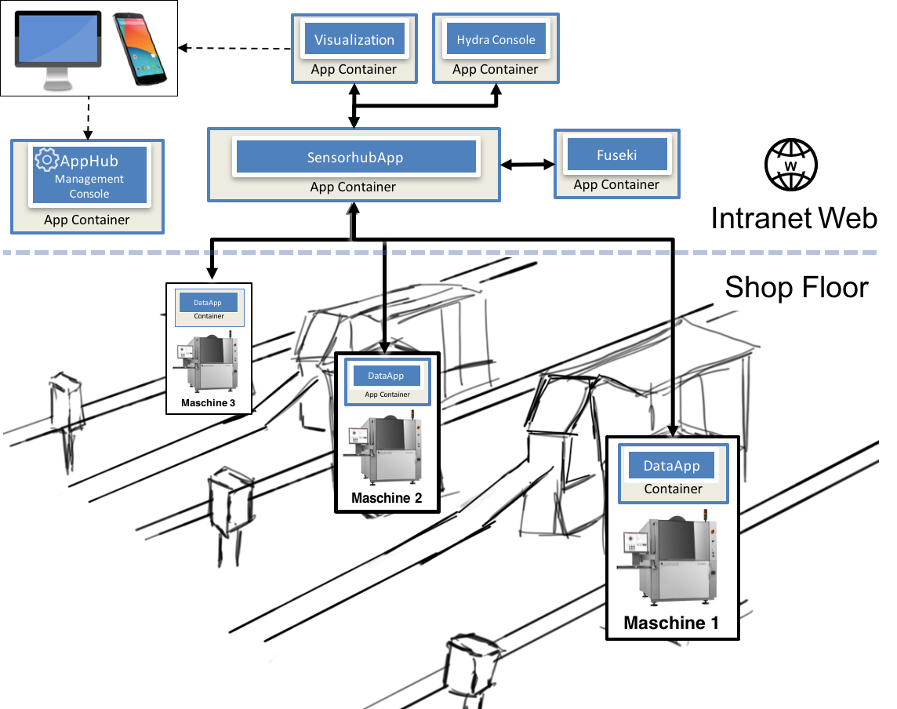
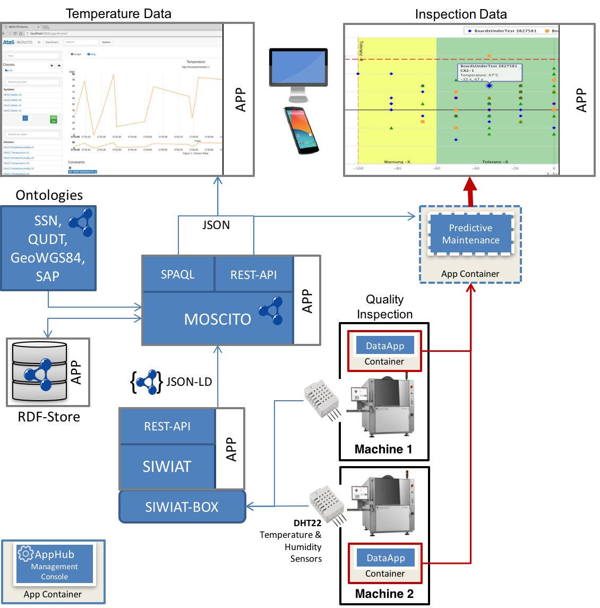

.. _success stories:
ScaleIT Success Stories
=======================

.. todo::
    Publish success stories.

Shopfloor Monitoring bei der SICK AG
------------------------------------

**Involved partners**: Ondics GmbH, Worldline, SICK AG, KIT

**Results**: Better understanding of live data and optimization potential

Electronic manufacturing is a sensitive process in which humidity and temperature, for example, play an important role. To ensure quality, optical inspection steps are performed on every printed circuit board (PCB).

    Anwendungsszenario der Apps bei der SICK AG

However, under certain conditions, issues with the PCBs may still arise. Therefore, to improve the quality and throughput, the shop floor has to be continually upgraded with new capabilities that allow employees to promptly react and reduce errors. 

First, employees need to visualize the quality inspection data, both on large screens and their smartphone. This in turn allows them make timely and more informed decisions. Second, temperature and humidity sensors need to be installed in order to monitor the production environment. In case some sensors use different units (˚C vs. ˚F), they still need to present meaningful data to workers or other machines. Third, inspection, temperature and humidity data need to be aggregated for both workers and data analysts. The latter need to be able to use the data in order to train machine learning models for predictive maintenance. 

The fourth and final step, is the deployment of the machine learning algorithm into production and associating the predictions with machine location and PCB meta-data. This scenario requires physical devices and software from different vendors that need to interoperate to achieve the desired outcome. While the predictive analytics step is still in development, the mashup is explained in greater detail in the following section.

    Gesamtüberblick des implementierten Szenarios zu Sensordatenfusion 

The proof of concept mashup shown in the figure above, consists of apps that are implemented as stand-alone Docker containers with functionality restricted to a small, business value generating subset. Every app is uniquely identifiable and addressable within the web by its URL and RESTful interactions are possible. 

The apps have been developed independently and we have relied on common semantics to allow their interoperation. The App Hub (lower left) is a simple app store. It manages each app’s life cycle by generating Docker-Compose files according to which apps are part of requested mashups. SIWIAT3 is an embedded gateway-as-a-box with internal apps developed by the authors and targeted at the industrial shop floor. Its role is to wrap legacy or non-web-capable sensors, annotate the measured values and make them available via a REST interface. 

MOSCITO4 is a semantic middleware developed by Worldline based on OSGI, Apache Jena, and the RDF4J framework. It provides a set of functionality for the management of semantically linked data accessible through RESTful Web Services, such as ontology and rule management, and, moreover, SPARQLEndpoints as well as triple store connections and data integration from heterogeneous data sources. MOSCITO acts as a shop floor semantics engine and a visualizing tool that collects and connects related data form heterogeneous data sources but also manages ontologies and rules. 

Machine 1 and 2 are automatic optical inspection (AOI) machines. Inspection data is available via publish/subscribe through the data app (using server-sent events). Adding another machine to the mashup requires just the installation of the data app for the corresponding machine from the store. 

The inspection data is visualized inside a web app that uses a responsive design. By leveraging the semantic annotations in the payload this visualization app can also associate the different input data from the inspection machines with the aggregated temperature data from MOSCITO. Both SIWIAT and MOSCITO do not need to rely on a common predefined data model for exploring, visualizing or processing data. Therefore, the integration of shop floor data into business processes can be performed using semantics-driven. These apps may even proxy the interaction to enterprise resource planning (ERP) or manufacturing execution system (MES) systems.  

Das Publizierte Paper über den Use-Case ist in der `ACM digital library zu finden <https://dl.acm.org/citation.cfm?id=3017999>`_, eine kostenfreie Variante kann man über den Authorizer-Link der `Author-Website <http://www.teco.edu/people/miclaus/>`_ beziehen.

Ondics GmbH
-----------

