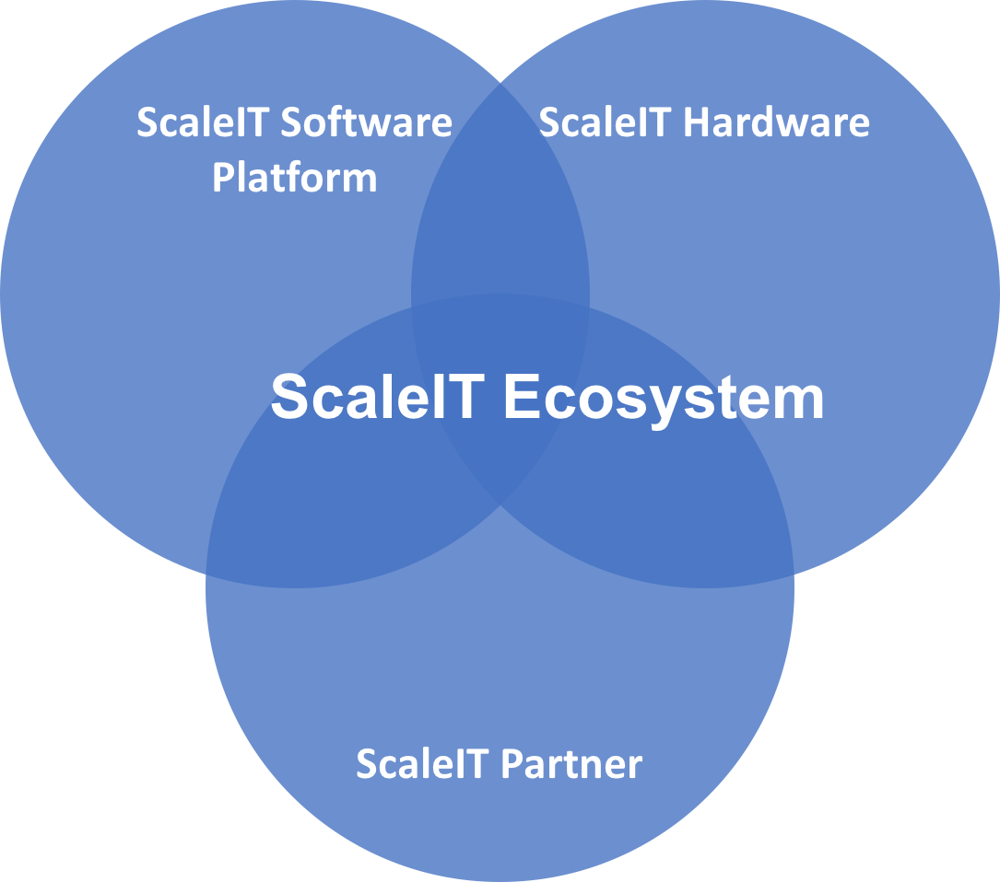
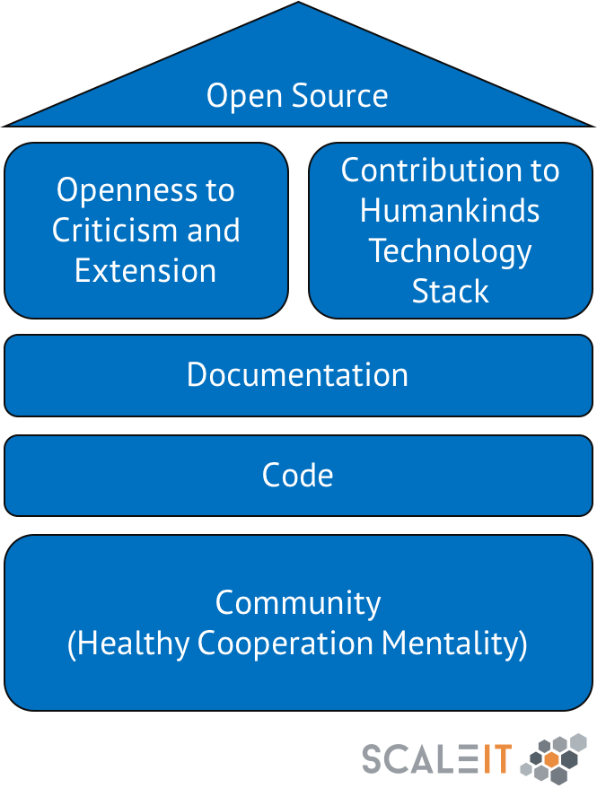

.. _what is scaleit:
What is ScaleIT?
================

ScaleIT is a solution to bring advanced IT technologies to manufacturing companies. We bring the necessary **software and hardware infrastructure** to the manufacturing shop floor of small and medium companies and help people work better by introducing **modern Industrial Grade Apps**.

It is a work in progress created within the ScaleIT Project funded by the BMBF (Fkz.: 02P14B180ff).

.. note::
    ScaleIT Value Proposition
        :ref:`Ich möchte jetzt erfahren wie mir ScaleIT auf dem Hallenboden hilft! <value proposition>`

There are three main components to the ScaleIT solution the ScaleIT Software Platform, ScaleIT Hardware and the ScaleIT Community, as seen in the figure below.

ScaleIT Software Platform
  In IT, a platform is any hardware or software used to host an application or service. An application platform, for example, consists of hardware, an operating system and coordinating programs that use the instruction set for a particular processor or microprocessor [#f1]_. 

  Have a deeper look at the software architecture :ref:`here <ScaleIT Architektur>`.

ScaleIT Hardware
  WIP, coming soon

ScaleIT Partner and the ScaleIT Community
  `Meet the people of ScaleIT <https://medium.com/@scale_it_org/the-people-of-scaleit-382866ff4226>`_

ScaleIT is Open Source
    When a project is open source, it means anybody can view, use, modify, and distribute your project for any purpose. These permissions are enforced through an open source license.

    Learn why this is important `OSS for German Manufacturing <https://medium.com/@scale_it_org/a-push-towards-bringing-open-source-mentality-to-german-manufacturing-e29d5af84875>`_

    ScaleIT is being published with an MIT license.

   Pillars of open source projects.
 
.. todo::
  Better image with ScaleIT Eco System, ScaleIT Software Platform, ScaleIT Hardware
   

.. rubric:: Footnotes

.. [#f1] https://searchservervirtualization.techtarget.com/definition/platform
.. [#f2] https://commons.wikimedia.org/wiki/File:Ab-test.jpg

